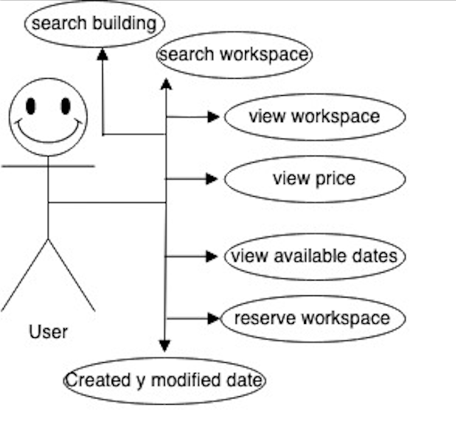

# Name and Short Description Aplication: 
The application that I have made is a replica of a workspace rental page.

## Description English

One of the hardest things is learning what you don't know. And one of the fastest ways to learn this is to interact with people from different backgrounds and disciplines. Coworking allows you to get out of your bubble and work with others who know what you don't know, and in this way you can open your mind finding capabilities that you never thought you had and that's why I decided that my first project as a developer would be about a coworking.
Because there are a thousand and one ways of working, but as a team it is always easier.

## Description Spanish

Una de las cosas más difíciles es aprender lo que no sabes. Y una de las formas más rápidas de aprender esto es interactuar con personas de diferentes orígenes y disciplinas. El coworking te permite salir de tu burbuja y trabajar con otros que saben lo que tú no sabes, y de esta manera puedes abrir tu mente encontrando capacidades que nunca pensaste que tenías y es por eso que decidí que mi primer proyecto como desarrollador sería sobre un coworking.
Porque hay mil y una formas de trabajar, pero en equipo siempre es más fácil.

## Technical Description
This page is a responsible application made with javascript, react and tailwind, it plays with the sizes of the devices, making the application navigable both on desktop and mobile, it has a calendar where the user can select the dates in which they need space and has a login, registration and password change.

## Functional Description

### Use Cases
-- Search building
-- Wiew workspaces the buildings
-- Search workspace
-- Wiew workspace
-- Wiew prices
-- Explore workspace
- Reservation workspace
-- Adjust settings(name, email,password,...)

### UI design

### Technical Description
- Blocks
- Sequence
- Components
- Code Coverage (Testing)
- Technologies

### Technologies
Html
Css 
JavaScript
NodeJs 
Express.js
Mongoose from  MongoDb
Tailwind
React
Jest (Testing) 
Winston

### Data Model

 User
- id: ObjectId --> automático mongo
- name:string
- email: string
- password:string

Reservation
- id: ObjectId 
- user: ObjectId ref: 'User'
- workspace: ObjectId
- date: Date
-createdAt: Date
- modifiedAt: Date

Building
- name: string
- address: string
- image: string

Workspace
- building: ObjectId
- name: string
- price: number
- image: string
- description: string

## Roadmap

Spint 0

Version 0
-- Figma
-- Data model & schemas
--Data model to mongoose
--Implement tailwind
--Populate data into db(populate.js)
--Implement user logic
--Implement locations, workspaces & reservation
--Implement API specs
--implement routes
--implement the pages app
--implement the components app
--test insomnia
--navigate api & app
--responsive app
--Test coverage
- Input validations API
- Input validations APP

Sprint 1

Version 1
--payment 
-- map ubication geospatial 
-- calendar not input
-- menu the version mobile
-- theme color, application
--favorite the ubication
--range price filter
-- shearch the ubication

-

Extra-Iteracion V0 --V1   para poder hacer todo tendrá una parte de mapa para poder hacer la ubicación del espacio de trabajo esto en V1,
En una segunda versión, permitir que los usuarios puedan darle like a sus espacios favoritos, además poder agregar un map con geospatial queries mongodb, un apartado de noticias, videos informativos, pasarela de pago

